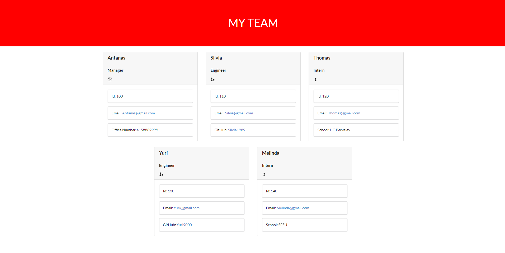

# GetYourTeamOrganized

### Welcome to the README file for my *GetYourTeamOrganized* application. Below is all the information needed to fully understand this application.

---

##### *license!*

## Table of Contents

* [Description](#description)

* [Installation](#installation)

* [Usage](#usage)

* [WalkThrough-Video](#walkthrough-video)

* [Testing](#testing)

* [Future](#future)

* [Questions](#questions)

----

## Description

 The application can be used through a terminal as long as the user has [node.js](https://nodejs.org/en/download/) installed. The LTS version is recommended. A few more packages are required to run this application. If the user downloads this repository the packages are included. More information on the packages needed are in the Installation section of this README. This application is intended to help an employer generate an HTML file with their emplyees information. It generates one manager employee card and as many engineer and intern employee cards as the user desires. The 'usage' section will walk the user through the process. For further help a walk through video is provided in the 'WalkThrough-Video' section. 
 

---

## Installation 

If the user decides to download the repository, jest and the other dependencies will come with it. The user will still need to download Node.js if the user doesn't already have it.

As stated in the description section [node.js](https://nodejs.org/en/download/) is needed to run this application. [Jest](https://jestjs.io/docs/getting-started) is also required to run tests. If you click on the Jest link there are further instructions on jest and its complexities. Make sure to go to your package.json file, scroll down to the debug section, and in the "test:" field make sure to replace the message with 'jest'. Running tests(npm run test) in your terminal will not work otherwise. Two other dependencies needed are [Expect](https://www.npmjs.com/package/expect.js/v/0.3.1) and [Inquirer](https://www.npmjs.com/package/inquirer) . Click on the links for further installation instructions. For more information on [npm](https://docs.npmjs.com/cli/v8/commands/npm) click on the link to better understand how it functions as a package manager. 

---

## Usage

Below is a series of screenshots and directions to help/walk the user through the process of using this application. By the end of it the user should be able to produce an HTML file that contains employee cards for a manager, engineers, and interns with the help of this application. A walk through video is provided after the usage section. 

---
Once the repo is downloaded onto the users computer, the user can open the application in their IED.[Visual Studio Code](https://code.visualstudio.com/) is recommended. After the user opens up the application in their IDE, and sees the files to the left of them. The should right click on the index.js file and open it in an integrated terminal. The user will then type in 'node index' in said terminal. The user will then be greeted with a promt and the first question will be to add their managers name. The second question will ask for their designated employee number. The third question will ask the user to add their managers email. The fourth question will ask the user for their managers office phone number. All of this information will populate in an empliyee card. After the user inputs their managers office number a list with the options to generate an intern employee card, engineer employee card, or the third option to finish and generate the HTML file. 

.png)

---

 If the user selects engineer they will be presented with the series of questions seen below. The user will be asked to for the engineers name, employee number, e-mail, and GitHub. After the user is done answering these questions they'll once again be presented with a list with the three options stated in the directions above. 

 .png)

---

If a user chooses to make an intern employee card the user will be presented with the series of questions as seen in the image below. The user will be asked for the students name, employee number, e-mail, and school they currently attend. The user may choose to make as many intern and engineer employee cards as they wish. 

.png)

---

Once the user is done building however many employee cards they need and select the 'build team' option. The application will let the user know that they have successfully built up their team up. The HTML file generated will look like the image below. The e-mail and GitHub links are clickable. 

---

## Walkthrough Video

Below is a link for the user to download my walkthrough video. It briefly goes over the testing process and shows that the tests run and pass. And shows the user how to use the the application.   

[WALKTHROUGH VIDEO!!!!](https://drive.google.com/file/d/19d_FibYXVaAjm89lFGBwiKIvlZdiBGiw/view)

---

## Testing 

As shown in the video: all test programs pass. below is an image indicating the results of when the command 'npm run test' is entered in an inegrated terminal.

.png)

---

## Future

---
If I were to make adjustments to this app I would add more employee types. Such as assistant manager, marketing executive, frontend developer, backend developer, and other various types of emplyees that are normally seen in a tech company. I would also add a field to assign the employee(s) to different teams and group them as such. I would also add a timestamps indicating when the employee was added and for changes made to their employee card. Such as role, team, phone number, GitHub, and various other options. 

---

## Questions

 This README file shows and indicates that criteria is met. 

>Contact infromation:

If you have any questions about the repo, open an issue or contact me directly at campos.santiago138@gmail.com. You can find
more of my work at [my GitHub](https://github.com/Everyone1138).

---

###### ©️ Santiago Campos 2022 ©️